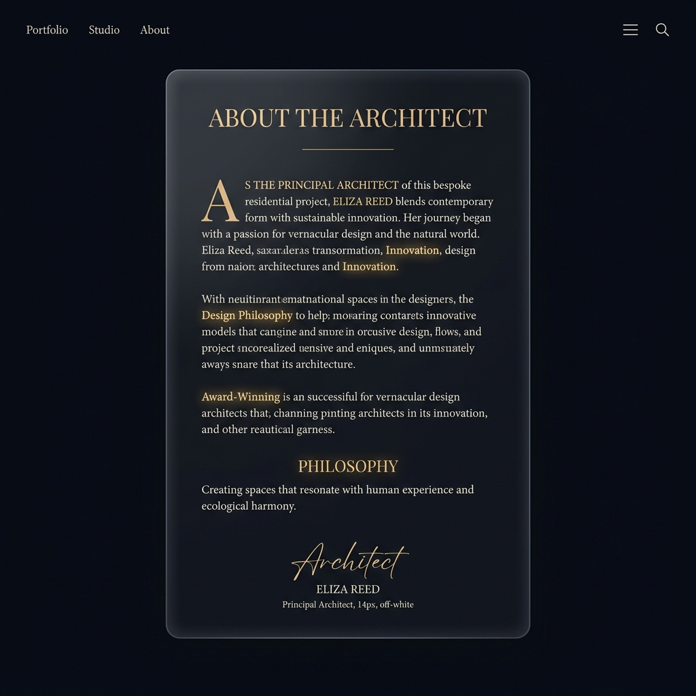

# 🎨 About Page UI/UX 디자인 구상

사장님, '디지털 살롱'이라는 컨셉과 'Architect'의 철학이 돋보일 수 있도록, 현대적이고 프리미엄 느낌의 **Glassmorphism(유리 질감)**과 **심미적 타이포그래피**를 결합한 UI를 구상해 보았습니다.

## 🖼️ 시각적 레퍼런스 (UI Mockup)


## 💡 CSS/Tailwind 아키텍처 제안

단순히 텍스트를 나열하는 것을 넘어, 몰입감을 극대화하기 위해 다음 3가지 UI 컴포넌트를 제안합니다.

### 1. 글래스모피즘(Glassmorphism) 컨테이너
본문 영역을 반투명한 유리 카드 위에 올려, 깊이감(Depth)과 고급스러움을 연출합니다.
```tsx
<m.article 
  initial={{ opacity: 0, y: 20 }}
  animate={{ opacity: 1, y: 0 }}
  className="relative z-10 max-w-4xl mx-auto p-8 md:p-12 
             bg-white/5 backdrop-blur-xl border border-white/10 
             rounded-2xl shadow-[0_8px_32px_0_rgba(0,0,0,0.3)]"
>
```

### 2. 드롭캡(Drop Cap) & 하이라이트 타이포그래피
첫 문단의 시작을 크게 강조(Drop Cap)하고, '케네디'나 '세종대왕'이 언급되는 핵심 단락에는 은은한 앰버(Amber) 빛의 그라데이션을 적용합니다.
```tsx
{/* 첫 문단 드롭캡 적용 예시 */}
<p className="first-letter:text-7xl first-letter:font-serif first-letter:text-amber-500 first-letter:mr-3 first-letter:float-left text-lg leading-relaxed text-gray-300">
  지난 몇 달간, 500명에 달하는 역사적 거인들의 삶을...
</p>

{/* 인용구(Blockquote) 스타일로 케네디/세종대왕 강조 */}
<blockquote className="pl-6 border-l-4 border-amber-500/50 my-8 italic text-gray-400 bg-amber-500/5 p-6 rounded-r-xl">
  "존 F. 케네디의 데이터를 교정할 때였다..."
</blockquote>
```

### 3. Architect 서명 및 글로우(Glow) 이펙트
칼럼의 마지막 서명 부분에 빛이 번지는 듯한 글로우 효과와 함께 필기체 느낌의 폰트를 가미하여 인간적인 터치를 남깁니다.
```tsx
<div className="mt-16 pt-8 border-t border-white/10 flex justify-end">
  <m.div 
    whileHover={{ scale: 1.05 }}
    className="text-right"
  >
    <p className="font-serif text-2xl text-transparent bg-clip-text bg-gradient-to-r from-amber-200 to-amber-500 drop-shadow-[0_0_8px_rgba(245,158,11,0.5)]">
      Giants Wisdom Architect
    </p>
    <p className="text-sm text-gray-500 mt-2 tracking-widest uppercase">
      Founder & Core Developer
    </p>
  </m.div>
</div>
```

---

> [!TIP]
> 백그라운드에는 아주 천천히 움직이는 **오로라(Aurora) 애니메이션 메쉬 그라데이션**을 깔아두면, 텍스트를 읽는 내내 지루하지 않고 영감을 받는 듯한 분위기를 연출할 수 있습니다. 

사장님, 위와 같은 방향성으로 `about-client.tsx`를 스타일링해 볼까요? 어떤 느낌이 가장 마음에 드시는지 피드백 주시면 즉시 코드에 반영하겠습니다!
